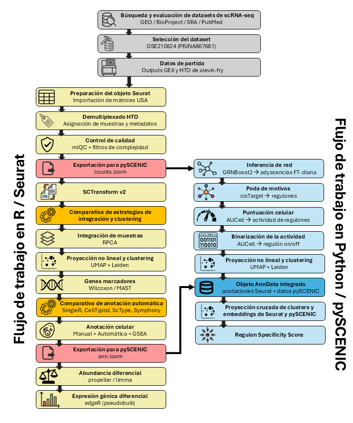

# TFM_scRNAseq

Repositorio asociado al TFM **“Caracterización de la heterogeneidad celular, transcriptómica y reguladora de linfocitos T CD4+ en la reversión de latencia del VIH-1 mediante scRNA-seq”** del Máster Universitario en Bioinformática por la VIU.

El proyecto reanaliza y amplía el estudio del dataset público **GSE210824 / PRJNA867681**, correspondiente a un modelo primario de latencia del VIH-1 tratado con un agente de reversión de latencia.

## Datos de scRNA-seq 

- GEO: `GSE210824` (BioProject: `PRJNA867681`)
- Outputs de cuantificación de `alevin-fry` (deben ser ubicados en 01_Seurat/Raw/)
- Muestras: linfocitos T CD4+ de 3 donantes sanos espinoculados ex vivo con constructo pNL4.3Δ6-GFP
- Condiciones: `Control` y `HA15`
- Estado viral definido por expresión de `Tat` o `Rev` (splicing múltiple)

## Otros datos externos necesarios

- barcode whitelist (a ubicar en 01_Seurat/Raw/): https://teichlab.github.io/scg_lib_structs/data/10X-Genomics/translation_3M-february-2018.txt.gz
- referencia PBMC multimodal (a ubicar en 01_Seurat/Ann/): https://zenodo.org/records/7779017/files/pbmc_multimodal_2023.rds
- atlas CD4 (a unbicar en 01_Seurat/Ann/screfmapping): https://github.com/yyoshiaki/screfmapping
    - screfmapping/data/cache_symphony_sct.uwot
    - screfmapping/data/ref_Reference_Mapping_20220525.RData (https://doi.org/10.6084/m9.figshare.25052648)
    - screfmapping/utils_seurat.R
    - screfmapping/ref_mapping_seuratobj.R
- ranking genómico de motivos cis-reguladores (a ubicar en 02_pySCENIC/aux_data/): https://resources.aertslab.org/cistarget/databases/old/homo_sapiens/hg38/refseq_r80/mc9nr/gene_based/hg38__refseq-r80__10kb_up_and_down_tss.mc9nr.feather

## Datos procesados aportados

- Objeto Seurat inicial `01_data_prep_and_QC.rds` (01_Seurat/Proc/).
- Todos los archivos procesados de pySCENIC a excepción de `adj.tsv` (02_pySCENIC/proc_data/).

## Estructura del repositorio

```text
TFM_scRNAseq/
├── 01_Seurat/
│   ├── Ann/                         # bases de datos y referencias para anotación celular
│   ├── Code/                        # scripts en R
│   ├── Proc/                        # objetos Seurat procesados
│   ├── Raw/                         # datos de conteo de scRNA-seq, barcodes y tabla de genes
│   ├── Results/                     
│   └── SCENIC/                      # inputs para pySCENIC (datos de conteo y anotaciones)
│
└── 02_pySCENIC/
    ├── analysis/                    # libretas en Python
    ├── aux_data/                    # archivos auxiliares (lista FTs, ranking genómico y motivos cis)
    ├── proc_data/                   # datos procesados de pySCENIC
    ├── raw_data/                    # inputs de pySCENIC
    └── results/

Las carpetas de resultados vacías se incluyen para mantener la estructura de directorios y rutas relativas.  
```

## Flujo de trabajo



## Orden de ejecución de código

01_Seurat/Code/
- 01_data_prep_and_QC.R (-> aquí ya se puede iniciar la inferencia de GRN en pySCENIC en paralelo)
- 02_scRNAseq_basic_v2.R (usa MAST y ranking score para marcadores. Wilcoxon por % células expresoras en 02_scRNAseq_basic_v1.R)
- 03a_ann_cell_auto.R
- 3b_ann_clust_gsea.R (-> aquí ya se puede integrar las anotaciones con la libreta 2 de pySCENIC)
- 04_cell_abundance.R y 05_DGE.R
  
02_pySCENIC/analysis
- 01_complete_pyscenic_outputs.ipynb
- 02_integrate_pyscenic_with_seurat.ipynb
- 03_regulon_analysis.ipynb

Scripts auxiliares, fuera del flujo:
- 00_benchmark_int_clust.R
- 00_benchmark_ann_cell.R
- figuras_GSEA.R
- wordcloud_tfm.R
